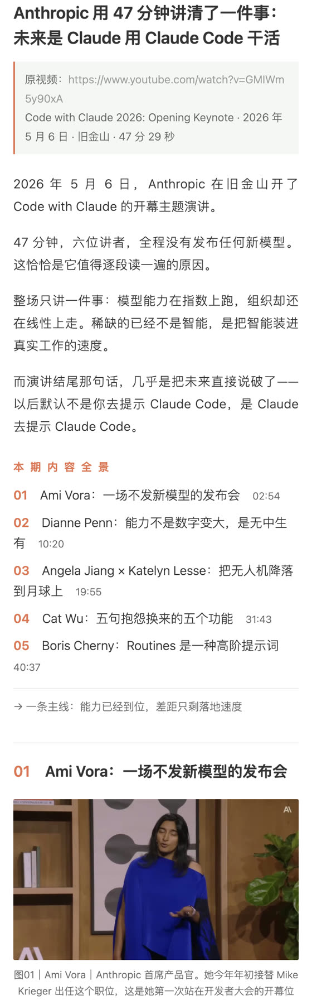
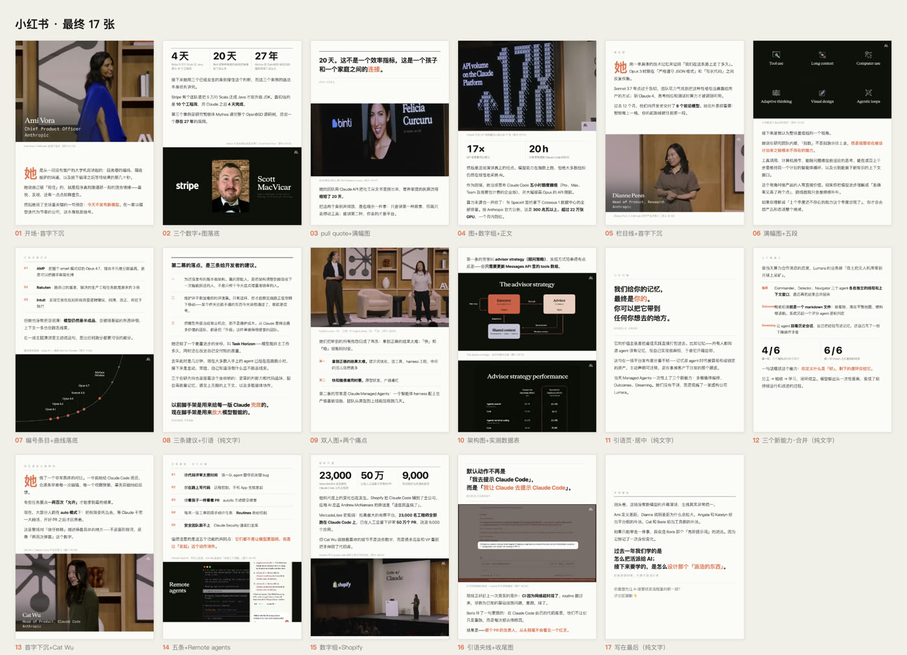
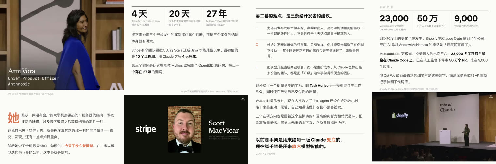

# video-to-social


把一场长演讲、访谈、课程或会议视频，变成一篇能发的公众号长文和/或一组能发的小红书卡片。

这不是一个"喂链接出文章"的黑盒，而是一条**每步都可回查**的流水线：
文章里每张配图都标着原片时间码，读者可以拿着 `22:21` 回去核对。

> 全流程用 Claude Code 跑通并反复迭代过一遍真实选题（Anthropic 的 Code with Claude 2026 开幕演讲）。
> 仓库里是**方法与工具**：不含原片，也不含全分辨率截帧；
> `docs/` 下只有预览级的效果图。

---

## 成品长什么样

用 Anthropic《Code with Claude 2026》开幕演讲（47 分 29 秒）跑出来的实际结果。

**公众号**：3918 字 · 5 节 · 20 张配图 · 两张封面。每张图注都带原片时间码。



**小红书**：17 张 1080×1440，每页一种版式，不复用模板。



四种版式的样子——首字下沉、大数字组、纯文字页、人物页：




> 图中演讲画面版权归 Anthropic 所有，此处作工具效果演示；
> 仓库不含原片与任何全分辨率截帧。

---

## 为什么需要这个

把长视频转成图文，看起来是"转录 + 摘要 + 配图"三步，实际每一步都有坑：

| 你以为 | 实际 |
|---|---|
| 转录出来就能用 | whisper 在无人声段落会疯狂重复上一句，能吞掉几分钟内容且毫无提示 |
| 截图随便截 | 远景舞台帧在手机上什么都看不清，配图等于没配 |
| 网页排版能复用 | 公众号会把 JS 全部剥掉，交互式设计一上去就废 |
| 一份稿子两边发 | 公众号是"读"，小红书是"先扫图再决定读不读"，结构必须重做 |

这套流水线把这些坑固化成了脚本、条件路由和可判定检查。

---

## 核心设计：一份文案源

```
content.py  ──┬── validate_content.py → 内容、素材、时间码和渠道检查
              └── build.py --channel ... → audit_outputs.py → 可发布交付物
                    ├── 公众号 → HTML / MD / 配图 / 封面
                    └── 小红书 → 1080×1440 卡片 / 正文 / 使用说明
```

文字、图注、时间码**只写一次**。改文案只改 `content.py`，两个渠道重跑即可，永远不会分叉。

素材用稳定 ID 登记，正文用 blocks 表达，精确控制图文顺序：

```python
ASSETS = {
  "speaker-01": {"time": 140, "caption": "人物图｜姓名、职务、一句背景"},
}
SECTIONS = [
  dict(no="01", tc=174, title="第一节", blocks=[
    ("fig", "speaker-01"),
    ("p",   "段落。关键数字用 **12 万** 标；全场最关键的判断用 ***三星号*** 标。"),
    ("q",   ("一句值得拎出来的原话。", "讲者姓名")),
  ]),
]
```

---

## 流程

```
① 取源    yt-dlp 下片 + ffmpeg 抽 16k 单声道音频
② 转录    whisper.cpp → SRT/JSON，审计连续幻觉
③ 分章    读转录切 5~8 节，按讲者分节比按议题分更好用
④ 选帧    "带字优先"挑图，逐帧核对
⑤ 写文案  填 content.py
⑥ 出片    build.py 条件路由 → 构建器 → 输出审计
```

```bash
./scripts/fetch_video.sh "https://www.bilibili.com/video/BVxxxx/"
./scripts/transcribe.sh keynote_audio.wav en
cp scripts/content_template.py content.py   # 填写
python3 scripts/validate_content.py --channel all
python3 scripts/build.py --channel all
```

只生成一个渠道时使用 `--channel wechat` 或 `--channel xhs`。已有本地视频、字幕或选定帧时跳过对应前置步骤；`build.py` 会只路由到需要的构建器，并在最后自动审计文件、编号和图片尺寸。

---

## 四个真踩过的坑

### 1. whisper 会幻觉，且专挑无人声段落

一次实测里，42:36–45:00 整整 2.5 分钟被同一句话刷屏，而那恰好是全片信息密度最高的一段。
`transcribe.sh` 跑完自动扫重复并给出重转录命令：

```bash
whisper-cli -m <模型> -f audio.wav -ot 2550000 -d 160000 -mc 0 -of fix -otxt
#                                                        ^^^^^ 关掉上下文继承，这是防重复的关键
```

### 2. 讲者姓名角标只出现几秒，按 10 秒采样必然扫漏

不要靠人眼翻缩略图。`find_frame.py` 拿一张参考图做全片逐秒灰度比对：

```bash
python3 scripts/find_frame.py keynote.mp4 参考图.jpg
#   02:20 (140.00s)   差值   7.8   ← 命中
```

实测中有一张角标扫了两遍都漏掉，最后是靠这个脚本在 2849 秒里精确定位到的。

### 3. `object-fit: cover` 会裁掉原帧上下

为了把图塞进固定高度而用 cover，可能正好切掉人物的姓名角标——那恰恰是这张图唯一的信息。
人物图一律用自然高度满幅。

### 4. 公众号会剥掉 JS

交互式时间轴、可折叠脑图、滚动动画在公众号里全部失效。
网页版设计不能照搬，得改成静态编号目录。

---

## 两个渠道的硬约束

| | 公众号 | 小红书 |
|---|---|---|
| 正文 | 不限，3000~4000 字合适 | **建议 ≤950 字**（标签也算，留出发布余量） |
| 图 | 单独上传，需两张封面 | **≤18 张**，`1080×1440`，首图定点击率 |
| 排版 | 内联样式能保留，JS 会被剥 | 信息全在图里，正文只是引流 |
| 段落 | 15px 下每行约 21 字，"每段≤4行" = **84 字上限** | 每卡 3~6 段，靠版式换气 |

`validate_content.py` 会在渲染前检查结构、时间码和渠道限制；`build_wechat.py` 构建时还会逐段体检：

```
段落 ≤4 行体检： 1 处超长 ⚠️
   第02节 95 字：这一段是刻意写超长的测试用例，用来确认段落体检真…
```

---

## 排版上的两个判断

**强调分两级。** 加粗和换色都是强调手段，同时上是双重冗余。

```
***文字***   品牌色加粗 —— 全文只留 5~8 处最关键的判断
**文字**     纯黑加粗   —— 关键数字与术语首次出现，不换色
```

实测一篇 96 段的稿子里有 107 处加粗，等于没有重点；降到 38 处才立得住。

**小红书每页换一种版式。** 版式库见 [references/xiaohongshu.md](references/xiaohongshu.md)：
首字下沉、大数字组、pull quote、满幅图、编号条目、纯文字页、收尾页。
深底页穿插在浅底页之间，滑动时才有明暗呼吸。

---

## 目录

```
SKILL.md                 作为 Claude Code / Codex 技能使用时的入口
agents/openai.yaml       技能列表中的显示名称和默认提示词
references/pipeline.md   取源→转录→分章→选帧→核实 全流程细节
references/wechat.md     公众号排版规范与限制
references/xiaohongshu.md 小红书卡片版式库
scripts/common.py        路径、素材和浏览器运行时
scripts/validate_content.py 内容与渠道规则检查
scripts/build.py         条件路由入口
scripts/audit_outputs.py 构建后文件、编号和尺寸审计
scripts/audit_transcript.py 转录连续重复和全局重复审计
scripts/                 其余取源、转录、找帧和渲染脚本
tests/test_smoke.py      无媒体依赖的最小回归测试
```

单独审计已经生成的交付物：

```bash
python3 scripts/audit_outputs.py --channel all
```

运行回归测试：

```bash
python3 -m unittest discover -s tests -v
```

## 作为 Agent 技能使用

放进技能目录即可被 Claude Code / Codex 自动发现。仓库内层的 `SKILL.md` 是真正的 Skill 文件，项目根目录的 README 只是使用说明：

```bash
git clone https://github.com/charleshan7/video-to-social.git ~/.agents/skills/video-to-social
```

之后直接说「把这个视频转成公众号图文」就会命中。

---

## 依赖

`yt-dlp` · `ffmpeg` · `ffprobe` · [`whisper.cpp`](https://github.com/ggerganov/whisper.cpp) · Python 3 · Chrome/Chromium（无头截图）

Chrome 路径可通过 `VIDEO_TO_SOCIAL_CHROME=/path/to/chrome` 或 `CHROME_BIN=/path/to/chrome` 指定；脚本会自动探测常见 macOS/Linux 路径。

whisper 模型建议 `ggml-large-v3-turbo-q5_0`（约 547MB）。
国内下载走 [hf-mirror](https://hf-mirror.com) 并且**必须绕开代理**：

```bash
curl --noproxy '*' -L -o ~/.cache/whisper-cpp/ggml-large-v3-turbo-q5_0.bin \
  "https://hf-mirror.com/ggerganov/whisper.cpp/resolve/main/ggml-large-v3-turbo-q5_0.bin"
```

## 素材版权

这套工具处理的是**别人的视频**。抽出的截帧属于原作者，用于评述引用时请：

- 在文末保留原片链接与版权说明
- 图注标注原片时间码，让读者可回查
- 不要把原片或全分辨率截帧放进公开仓库

本仓库的 `.gitignore` 已经排除了 `*.mp4` / `images/` / `out/`；
`docs/` 下保留的是缩小过的效果预览图，用于说明工具产出的版式。

## License

MIT
